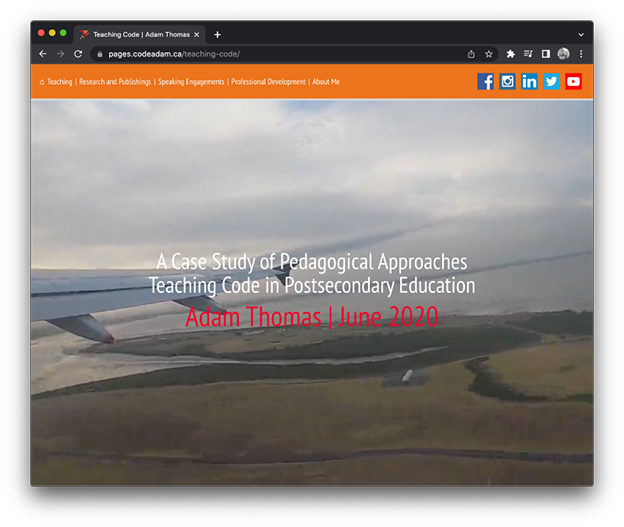

# SOTL Research Project on Teaching Code

In the winter semester of 2020 I was given the opportunity to visit a number of postsecondary educational institutions across the globe to research how they teach code.

This is a journal of my experience.

> Live journal can be viewed at:  
> https://pages.codeadam.ca/research-teaching-code/

***

## Repo Resources

- [Humber College](https://humber.ca/)
- [Otago Polytechnic](https://www.op.ac.nz/)
- [Otago University](https://www.otago.ac.nz/)
- [VIA University College](https://en.via.dk/)
- [Fontys](https://fontys.edu/)
- [Juno College](https://junocollege.com/)

 

